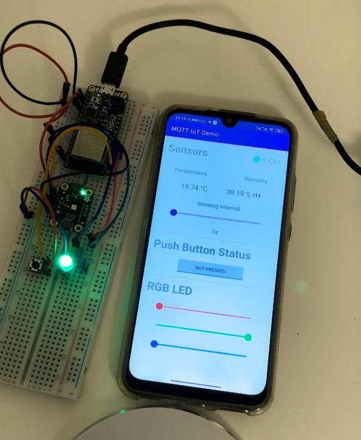

# ECE558 Project 2 - MQTT IoT & Android

## Directory structure
- `AndroidApp` : Android Studio Project for the App
- `esp32_mqtt_temp_humidity` : PlatformIO Project for the Adafruit ESP32 HUZZAH32 board
- `Demo_Video.mp4` : Video showing the project in action! Also available at Youtube: https://youtu.be/r7gPrQBGOfI

## Demo
